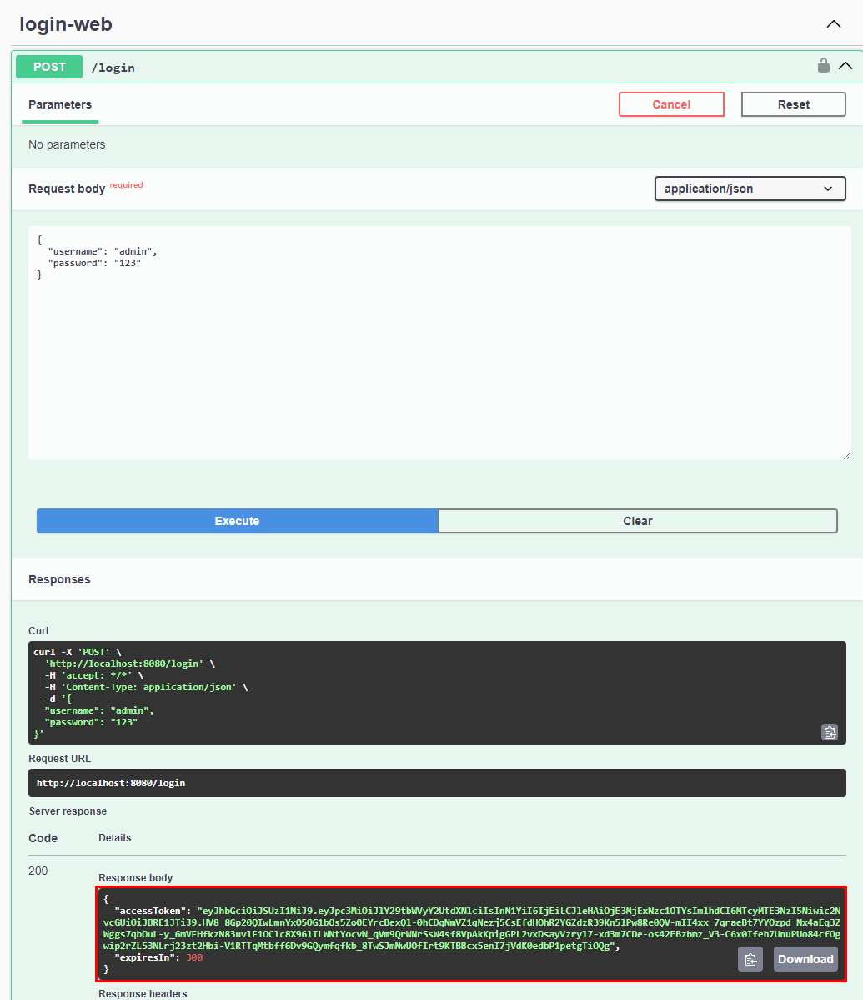
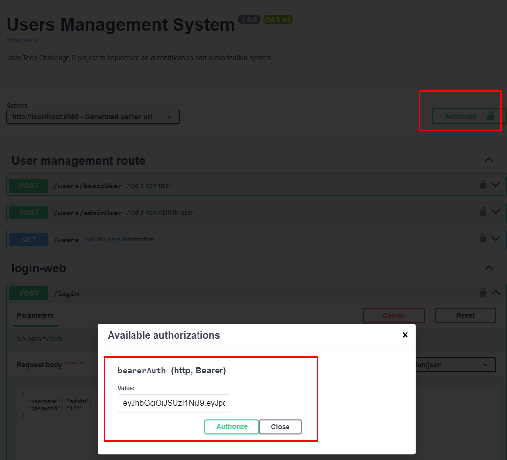
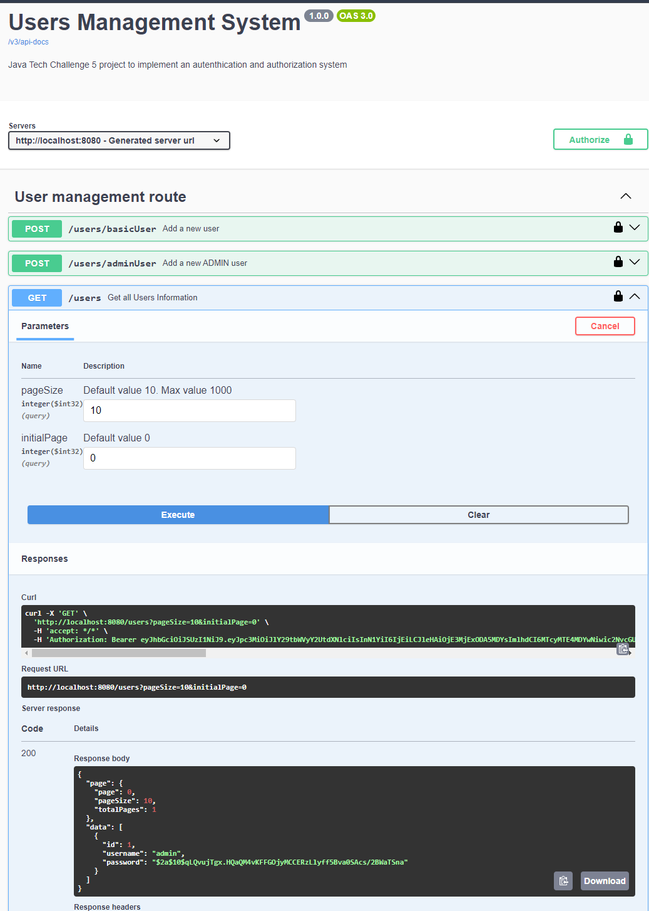

# FIAP Tech Challenge 5
## API para cadastro de usuários

Este repositório refere-se ao microsserviço de usuários para atender aos requisitos do desafio proposto pelo 
MBA em desenvolvimento Java, este projeto envolve a comunicação entre microserviços.

## Principais recursos deste microserviço

Responsável por cadastrar informações dos usuarios, assim será possível:
* Incluir novos usuários;
* gerar token para autorização no serviço;
* Consultar usuários do sistema;

## Tecnologias

* Spring Boot para a estrutura do serviço
* Spring Data JPA para manipulação de dados dos clientes
* Spring Security para autorização e autenticação via token JWT
* PostgreSQL para persistência

## Desenvolvedores

- [Aydan Amorim](https://github.com/AydanAmorim)
- [Danilo Faccio](https://github.com/DFaccio)
- [Erick Ribeiro](https://github.com/erickmatheusribeiro)
- [Isabela França](https://github.com/fysabelah)

## Sobre autenticação (opcional)

o método de autenticação utilizado pelo spring security, neste caso, se baseia em ter um par de chaves uma pública e uma privada, com as duas informações podemos gerar o token de acesso ao serviço.

Você poderá consultar o link a seguir que explica como gerar o par de chaves: https://cryptotools.net/rsagen

este código já dispõe deste par de chaves, são os arquivos "app.pub" e "app.key"


## Informações importantes!

Este serviço foi desenvolvido para ser um material de estudo. Portanto existem vunerabilidades que devem ser tratadas para um ambiente produtivo
é recomendado definir o nome de usuário e senha no arquivo de variáveis de ambiente ".env"
defina os valores preenchendo as seguintes variáveis, 

Banco de dados (postgree)
```
DATABASE_USERNAME=[USERNAME]
DATABASE_PASSWORD=[PASSWORD]
```

Usuário e senha padrão da aplicação (user admin do sistema)
```
SYSTEM_DEFAULT_USERNAME=[USERNAME]
SYSTEM_DEFAULT_PASSWORD=[PASSWORD]
```
vale ressaltar que caso não seja definido, o "AdminUserConfig" definirá valores padrões para o usuário e senha
``` java
    (...)
    @Value("${SYSTEM_DEFAULT_USERNAME:admin}")
    private String DEFAULT_USERNAME;

    @Value("${SYSTEM_DEFAULT_PASSWORD:123}")
    private String DEFAULT_PASSWORD;
    (...)
```

## Primeiros passos

Na raiz do projeto, rodar o comando para subir o container do postgreeSQL, criar o banco de dados e popular a tabela de regras (roles) com as regras padrões do sistema e após, inicie o sistema.
```
docker compose up
```

## Login com Swagger
por padrão, o tomcat irá subir o serviço na porta :8080, desta maneira você poderá acessar o swagger (documentação)
```
    http://localhost:8080/swagger-ui/index.html
```

Acessando a rota de login, poderá informar o usuário e senha e estando corretos o sistema irá gerar um token JWT com as credenciais para acesso as demais rotas.



copie o accesToken que foi gerado e cole no autorizador do Swagger


agora, você poderá acessar os demais recursos.



## Vendo o conteúdo de um token JWT
Com o token de acesso, você pode usar o site (https://jwt.io/) para decriptar um token JWT e ver o conteúdo deste, caso seja necessário:


## Como permitir somente usuário ADMIN à acessar uma rota?

Nas configurações da classe SpringSecurity (SecurityConfig), precisamos:
- Utilizar a *annotation* @EnableMethodSecurity, com ela deixamos responsáveis por definir o escopo de cada usuário à ser definido em cada uma das *restControllers*;
- Iremos definir as rotas que são de uso geral como *.permiteAll()*.

```
    @Bean
    public SecurityFilterChain securityFilterChain(HttpSecurity http) throws Exception {
        http
            (...)
            .authorizeHttpRequests(auth -> auth
                .requestMatchers(HttpMethod.POST, "/login").permitAll()
                .requestMatchers(HttpMethod.POST, "/users/basicUser").permitAll()
                .anyRequest().authenticated());

        return http.build();
    }
```

E em cada "RestController" Utilize a annotation @PreAuthorize, definindo que usuários com o escopo definido como "ADMIN" poderão ter acesso ao recurso.

```
@Operation(summary = "Get all Users Information")
@GetMapping
@PreAuthorize("hasAuthority('SCOPE_ADMIN')")
public ResponseEntity<PagedResponse<UserDto>> findAll(@Parameter(description = "Default value 10. Max value 1000", example = "10") @RequestParam(required = false) Integer pageSize,
                                                      @Parameter(description = "Default value 0", example = "0") @RequestParam(required = false) Integer initialPage) {

    Pagination page = new Pagination(initialPage, pageSize);
    return ResponseEntity.ok(this.userController.findAll(page));
}
```


## Agradecimentos

Na elaboração do projeto foi possível utilizar como fonte de consulta um vídeo no youtube.
Obrigado ao canal Build & Run por disponbilizar este conteúdo. O vídeo utilizado foi https://www.youtube.com/watch?v=nDst-CRKt_k